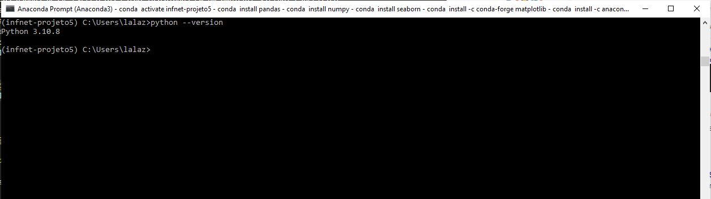
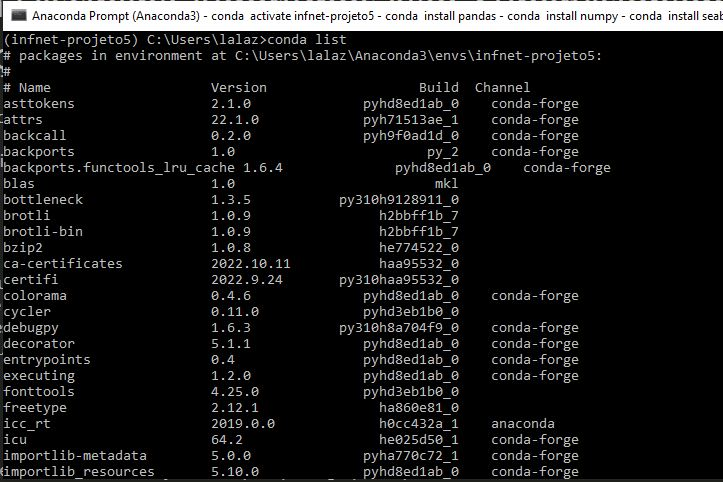

# Projeto da Disciplina Algoritmos Não-Supervisionados para Clusterização

- **Nome:** Laíssa Medeiros
- **Data:** 20/11/2022
- **Professor:** Luiz Frias

As respostas para as perguntas encontram-se destacadas abaixo em azul.

## Infraestrutura

Para as questões a seguir, você deverá executar códigos em um notebook Jupyter, rodando em ambiente local, certifique-se que:
- Você está rodando em Python 3.9+
- Você está usando um ambiente virtual: Virtualenv ou Anaconda
- Todas as bibliotecas usadas nesse exercícios estão instaladas em um ambiente virtual específico
- Gere um arquivo de requerimentos (requirements.txt) com os pacotes necessários. É necessário se certificar que a versão do pacote está disponibilizada.
- Tire um printscreen do ambiente que será usado rodando em sua máquina.
- Disponibilize os códigos gerados, assim como os artefatos acessórios (requirements.txt) e instruções em um repositório GIT público. (se isso não for feito, o diretório com esses arquivos deverá ser enviado compactado no moodle).

Utilizei um ambiente virtual no Anaconda com a versão 3.10 do python, conforme print de tela abaixo. As bibliotecas utilizadas, assim como as suas versões, podem ser verificas no arquivo requirements disponibilizado.

## Escolha de base de dados

Para as questões a seguir, usaremos uma base de dados e faremos a análise exploratória dos dados, antes da clusterização.
1. Baixe os dados disponibilizados na plataforma Kaggle sobre dados sócio-econômicos e de saúde que determinam o índice de desenvolvimento de um país.  Ver seção 0.2 do notebook.

2. Quantos países existem no dataset? Existem 167 países no dataset (ver seção 1.1 do notebook)

3. Mostre através de gráficos a faixa dinâmica das variáveis que serão usadas nas tarefas de clusterização. Analise os resultados mostrados. O que deve ser feito com os dados antes da etapa de clusterização? A faixa das variáveis pode ser vista na seção 1.5 do notebook. Na seção 2 foi realizada uma análise exploratória para analisar essas faixas de forma mais visula. Antes da etapa de clusterização, é necessário normalizar o dados para que as features fiquem todas com uma mesma escala.
   
4. Realize o pré-processamento adequado dos dados. O pré-processamento encontra-se na seção 3 do notebook.

## Clusterização
Para os dados pré-processados da etapa anterior você irá:

1. Realizar o agrupamento dos países em 3 grupos distintos. Para tal, use:
   1. K-Médias:  Ver seção 5.1 do notebook
   2. Clusterização Hierárquica:  Ver seção 5.2 do notebook
   
2. Para os resultados do K-Médias, interprete cada um dos clusters obtidos citando:
      1. Qual a distribuição das dimensões em cada grupo:  Ver seção 5.1.3 do notebook
      2. O país, de acordo com o algoritmo, melhor representa o seu agrupamento. Justifique:  Ver seção 5.1.3 do notebook
   
3. Para os resultados da Clusterização Hierárquica, apresente o dendograma e interprete os resultados:  Ver seção 5.2 do notebook

4. Compare os dois resultados, aponte as semelhanças e diferenças e interprete:  Ver seção 6 do notebook

## Escolha de algoritmos

1. Escreva em tópicos as etapas do algoritmo de K-médias até sua convergência.

    
    1. A primeira etapa é definir o número de clusters a ser passado como parâmetro inicial para o algoritmo do KMeans. 
    2. O algoritmo é iniciado definindo pontos centróides de forma aleatória para cada cluster  
    3. A próxima etapa é medir a distância de cada ponto até cada um dos centróides  
    4. Associar cada um dos pontos ao centróide mais próximo de acordo com as distancias medidas na etapa anterior  
    5. Depois, calcula-se o novo centróide de cada cluster, fazendo a média de todos os pontos do cluster  
    6. Repete-se todos as etapas a partir de 3  
    7. O algoritmo converge até o deslocamento entre as interações dos centróides for menor que um valor pré-definido ou quando o número de iterações pré-especificado for atingido.
    

2. O algoritmo de K-médias converge até encontrar os centróides que melhor descrevem os clusters encontrados (até o deslocamento entre as interações dos centróides ser mínimo). Lembrando que o centróide é o baricentro do cluster em questão e não representa, em via de regra, um dado existente na base. Refaça o algoritmo apresentado na questão 1 a fim de garantir que o cluster seja representado pelo dado mais próximo ao seu baricentro em todas as iterações do algoritmo.
Obs: nesse novo algoritmo, o dado escolhido será chamado medóide.

    
    1. A primeira etapa é definir o número de clusters (k) a ser passado como parâmetro inicial para o algoritmo  
    2. O algoritmo é iniciado selecionando de forma aleatória k pontos do dataset para serem os medóides   
    3. A próxima etapa é medir a distância de cada ponto até cada um dos medóides  
    4. Associar cada um dos pontos ao medóide mais próximo de acordo com as distancias medidas na etapa anterior  
    5. Depois, é considerado se a substituição de um medóide irá melhorar a qualidade do agrupamento. Então é realizado um cálculo iterativo   
    6. Para cada cluster, o medóide será substituído por cada um dos pontos que não são medóides  
    7. Repete-se todos as etapas a partir da etaoa 3  
    8. O processo iterativo de substituição dos medóides por outros pontos continua até a convergência da função objetivo, ou seja, até que ela pare de diminuir. Ou seja, caso a função objetivo dessa iteração seja maior que a anterior, volte ao medóide da etapa anterior.
    

3. O algoritmo de K-médias é sensível a outliers nos dados. Explique.

    
    Sim. O K-Means é sensível a outliers porque ele é baseado em médias. Os outliers são pontos que estão muito distantes da maioria dos outros pontos do dataset, e por isso, quando atribuídos ao cluster, eles podem distorcer a média, e consequentemente, irá afetar a atribuição dos pontos a esse novo centróide.
    

4. Por que o algoritmo de DBScan é mais robusto à presença de outliers?

    
    O DBScan é um algoritmo de clusterização baseado em densidade, diferentemente do K-Means que é bseado em médias. Ele analisa a densidade de pontos de dados em uma vizinhança para decidir se eles pertencem ao mesmo cluster ou não. Se um ponto estiver muito longe de todos os outros pontos, ele será considerado um valor atípico e será rotulado como outlier.
    
   